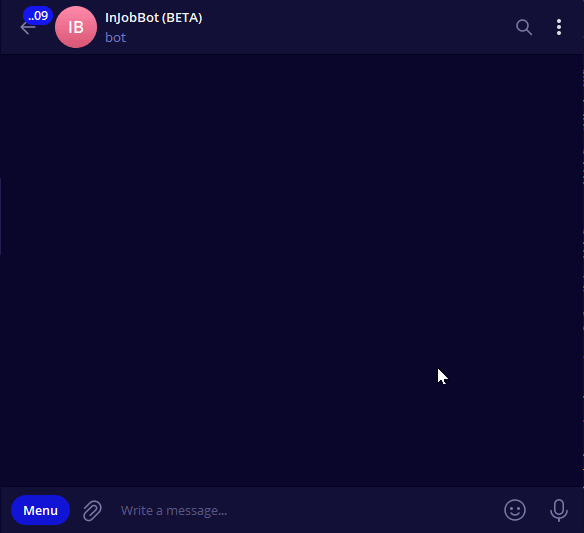

# Commands list

## The Job Command

InJobBot main functionality is to scrape jobs from [LinkedIn](https://www.linkedin.com/jobs), format it, and send it in Telegram chat Private | Group, which is done using the `/ljobs` command in telegram chat. If no arguments were passed to the `/ljobs` command; it will default to ^^*BI Data Analyst, Egypt*^^ search parameters.

??? example "Click to view `/ljobs` in action"
    <figure markdown>
    { width="500" }
    <figcaption>InJobBot job command.</figcaption>
    </figure>

****

## Helper Commands

InJobBot also comes with a set of helper commands like `/help` to display the help message for group members, `/tips` to display tips about setting your LinkedIn and GitHub profiles. More commands will be added in the future.

!!! Note
    The response to the `/help` command will differ depending on if the user is the **owner** of the bot, a **group admin** or a **group member**.

****

## Commands list

We are going to dive into each set of commands built into the bot. but for an overview here's a list of all the commands.

| Command 	| Description 	| Owner 	| Group Admin 	| Group Member 	|
|:---:	|---	|:---:	|:---:	|:---:	|
| /help 	| Display the help message. 	| ✅ 	| ✅ 	| ✅ 	|
| /tips 	| Display the tips message. 	| ✅ 	| ✅ 	| ✅ 	|
| /check 	| Check if bot is running. 	| ✅ 	| ❌ 	| ❌ 	|
| /ljobs 	| Searches LinkedIn for jobs default is BI Data Analyst Egypt. 	| ✅ 	| ✅ 	| ❌ 	|
| /ljobs job title, location 	| Searches LinkedIn for job tile in location. 	| ✅ 	| ✅ 	| ❌ 	|
| /echo 	| Echos back what ever you send it. 	| ✅ 	| ❌ 	| ❌ 	|
| /addgroup group id 	| Adds group to the allow list. 	| ✅ 	| ❌ 	| ❌ 	|
| /rmgroup group id 	| Removes group from allow list. 	| ✅ 	| ❌ 	| ❌ 	|
| /getgroup 	| Returns back a list of all allowed group id in database. 	| ✅ 	| ❌ 	| ❌ 	|
| /getgroup group id 	| Returns back the group id if it exists in the database. 	| ✅ 	| ❌ 	| ❌ 	|